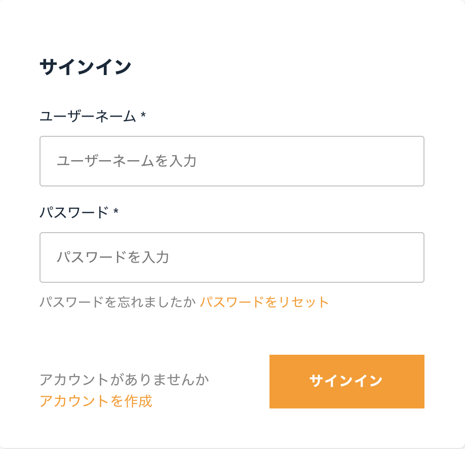

# @aws-amplify-jp/vocabulary-ja

Vocabulary dictionary for AWS Amplify's translations



## Getting started

Install the package via npm registry:

```console
$ npm install @aws-amplify-jp/vocabulary-ja
```

Import and put into `I18n` class of `aws-amplify`:

```js
import { I18n } from "aws-amplify";
import { Translations } from "@aws-amplify/ui-components";
import ja from "@aws-amplify-jp/vocabulary-ja";

I18n.putVocabulariesForLanguage("ja-JP", ja(Translations));
```
